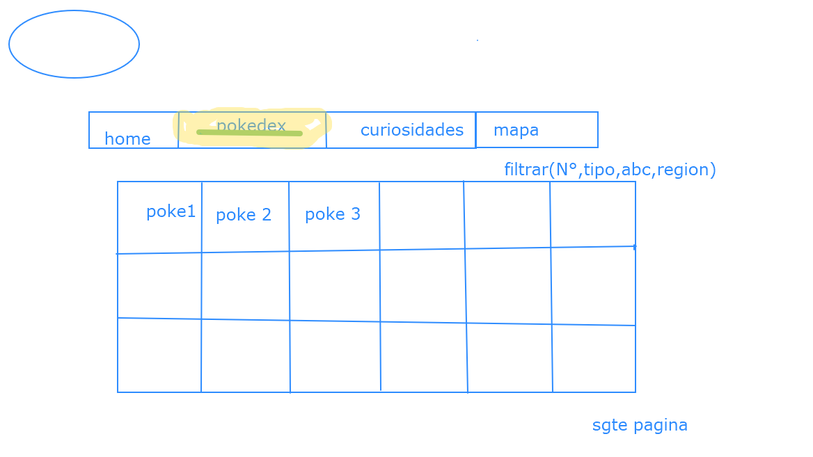

**## Proyecto Data Lovers "Pokemon Go para entrenadores"**

## Biendenid@s al repositorio de Giselle Cifuentes y Carolina Vera!

Nuestra idea partio pensando en una pagina web de data para los fans de la franquicia de Pokemon. Se escogio la data de Pokemon Go ya que ambas somos usuarias del juego y queriamos indagar mas sobre datos que nos pudieran servir a nosotras y a otros jugadores para poder mejorar nuestro desempeño en el juego. 

Iniciamos realizando las historias de usuario que surgen de la necesidad de conocer las caracteristicas de cada pokemon. 

## Historias de usuario:

Luego se realizaron distintos prototipos de baja fidelidad de como queriamos que fuera la web en relación a nuestras historias de usuario. Este prototipo se fue modificando hasta llegar a la interfaz que tenemos actualmente.

## Prototipo: 

De esta forma, hemos avanzado en nuestro proyecto "Pokemon Go para entrenadores" de Data Lovers, esperando ofrecer a los usuarios una herramienta útil y amigable para conocer más sobre los pokémon presentes en el juego.

**1. Descripción del proyecto:** Pokémon GO es un juego de realidad aumentada (RA) en el que los jugadores utilizan sus dispositivos móviles para capturar, entrenar y combatir con Pokémon, criaturas ficticias que aparecen en una variedad de medios de la franquicia de Pokémon. La idea del proyecto es ayudar a los jugadores a tener mas información útil mediante un analisis de datos de facil acceso. 

**2. Objetivos:** En el marco de nuestro proceso de aprendizaje, nos propusimos como objetivo principal conocer y aplicar diversas funciones en nuestro proyecto. En concreto, nos centramos en la utilización de la función **.filter**, que nos permitió filtrar los datos en función de los tipos de pokémon presentes; la función **.sort**, mediante la cual aprendimos a ordenar los datos alfabéticamente de forma ascendente y descendente; y la función **ComputeStats**, que nos permitió realizar cálculos estadísticos básicos y explorar algunas curiosidades del juego, como el peso de ciertos pokémon.

Asimismo, llevamos a cabo pruebas con **Jest** para evaluar la funcionalidad de nuestras funciones y asegurarnos de que cumplían con los requisitos esperados. De esta forma, pudimos avanzar en nuestro proceso de aprendizaje y obtener resultados satisfactorios en nuestro proyecto.

**3. Conjunto de datos:** Se nos proporcionó un conjunto de datos con información de 251 pokémon presentes en Pokemon GO. Cada uno de ellos contaba con datos como número de Pokédex, nombre, fortalezas, debilidades, entre otros atributos relevantes. Gracias a esta data, pudimos manipularla y obtener la información necesaria para trabajar en nuestro proyecto.

**4. Análisis de datos:** En este proyecto, utilizamos el lenguaje de programación JavaScript para analizar los datos de Pokémon GO. No se utilizaron bibliotecas externas para el análisis, sino que se escribieron funciones personalizadas para filtrar, ordenar y calcular estadísticas sobre los datos.

**5. Resultados:** Con respecto a nuestras historias de usuario, pudimos ayudar a los jugadores a conocer las fortalezas y debilidades de cada pokémon, lo que les permitirá mejorar sus habilidades en la liga de combate. Además, gracias al cálculo de las estadísticas de peso de los pokémon, hemos descubierto que Snorlax es el pokémon más pesado, con un peso de más de 460 kg, mientras que Blissey es el pokémon promedio en cuanto a peso, con 46 kg. En resumen, nuestro análisis de datos nos ha permitido obtener información valiosa y curiosa acerca de los pokémon en Pokémon GO. 

**Test de Usabilidad:** Los usuarios identificaron varios problemas relacionados con la usabilidad de la aplicación. Estos son algunos de los problemas que se detectaron:

- Los usuarios encontraron que el filtro de tipos de Pokémon no se agrupaba en orden alfabético, sino que solo los Pokémon de la sección "Todos los Pokémon" se ordenaban de esta manera.
- Se encontró un problema en el fondo de pantalla que solo se presentaba en algunos usuarios de iPhone, donde se veía pixelado en algunas secciones.
- En la pantalla principal, en algunos dispositivos, no se logra visualizar la imagen del profesor Oak.
- En dispositivos móviles, se observó que uno de los botones de filtro se salía del margen establecido.

**6. Conclusiones:** En conclusión, nuestro proyecto nos permitió adquirir nuevas habilidades en el manejo de datos y el análisis de los mismos en el lenguaje de programación JavaScript. Además, gracias a la aplicación de las funciones Filter, Sort y ComputeStats, pudimos obtener información útil y valiosa sobre los Pokémon en Pokémon GO, incluyendo sus debilidades y fortalezas de tipo, y datos curiosos como su peso. Este proyecto nos permitió profundizar nuestro conocimiento en el manejo de datos y técnicas de análisis, lo cual representa un logro importante en nuestro proceso de aprendizaje. En general, el proyecto nos dejó satisfechas con los resultados obtenidos y nos motivó a seguir explorando el mundo del análisis de datos.
